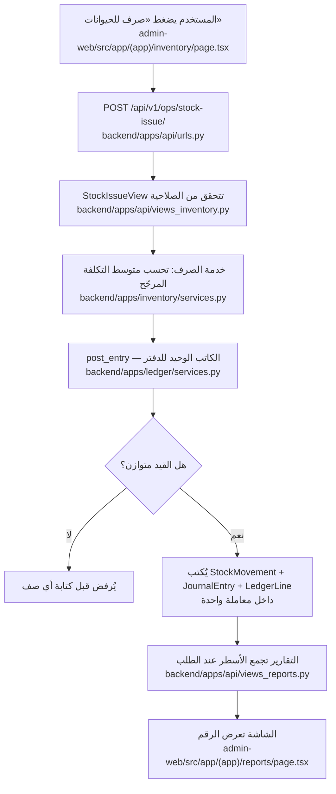
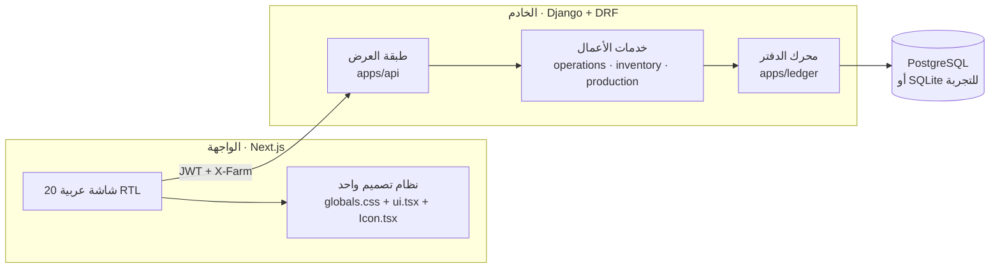

# ابدأ من هنا

> هذا الملف للشخص الذي يفتح المشروع لأول مرة. اقرأه كاملًا في عشر دقائق،
> وستفهم كيف يعمل النظام كله. البقية مراجع تُفتح عند الحاجة لا قبلها.

---

## 1. الفكرة في فقرة واحدة

هذا **نظام محاسبي** يُدير مزرعة أغنام، وليس تطبيق سجلات.

الفرق مهم: التطبيق العادي يحفظ رقمًا في عمود ثم يعدّله. هذا النظام لا يحفظ أي
رصيد أبدًا — كل رقم تراه على الشاشة **يُحسب لحظتها** بجمع قيود الدفتر.

لماذا؟ لأن العميل صاحب مزرعة، ويريد أن يعرف: كم ربح هذا الشهر؟ من يدين له؟ كم
كلّفته هذه النعجة من يوم شرائها؟ رقم محفوظ في عمود يمكن أن يخطئ ويبقى خطؤه
صامتًا. رقم محسوب من قيود متوازنة لا يستطيع أن يخطئ.

---

## 2. الشيء الوحيد الذي يجب أن تفهمه: القيد المزدوج

هذا هو الجدار الذي يتعثّر فيه كل من يفتح المشروع. تجاوزه ولن يبقى شيء غامض.

**القاعدة:** كل حركة مال تُكتب **مرتين**: من أين خرج المال، وإلى أين ذهب.
ومجموع الطرفين متساوٍ دائمًا.

الطرف الأول اسمه **مدين** (Debit)، والثاني **دائن** (Credit). لا تحاول ترجمتهما
لغويًا؛ اعتبرهما ببساطة **العمود الأيمن والعمود الأيسر**.

### مثال: اشتريت علفًا بـ 500 نقدًا

```
مدين   1300  المخزون          500      ← قيمة المزرعة زادت: عندها علف
دائن   1010  صندوق المزرعة    500      ← ونقدها نقص بنفس المبلغ
                             ─────
                              متوازن
```

لاحظ: **هذا ليس مصروفًا**. المزرعة لم تخسر شيئًا، بل حوّلت نقدًا إلى علف. مجموع
ما تملكه لم يتغيّر.

### ثم صرفت نصف العلف للحيوانات

```
مدين   5300  تكلفة الأعلاف المستهلكة   250   ← الآن صار مصروفًا
دائن   1300  المخزون                   250   ← والمخزون نقص
```

**هنا فقط** يصير العلف مصروفًا يقلّل الربح. هذه القاعدة الثامنة في
[README](../README.md): «العلف أصل حتى يُؤكل».

> **إن فهمت هذين القيدين، فهمت النظام.** كل ما تبقى تطبيق للفكرة نفسها على
> الحيوانات والحليب والرواتب والشركاء.

---

## 3. تتبُّع عملية كاملة: من الزر إلى التقرير

خذ عملية «صرف علف» وتتبّعها في الكود سطرًا بسطر. هذه أسرع طريقة لفهم البنية.



**الملفات الستة التي تحتاجها فعلًا:**

| الملف | ما يفعله |
| --- | --- |
| [backend/apps/ledger/services.py](../backend/apps/ledger/services.py) | **قلب المشروع.** `post_entry` هي الدالة الوحيدة التي تكتب في الدفتر |
| [backend/apps/ledger/chart.py](../backend/apps/ledger/chart.py) | شجرة الحسابات: `1010` صندوق، `5300` علف مستهلك… |
| [backend/apps/operations/services.py](../backend/apps/operations/services.py) | أوامر العمل: شراء، بيع، مصروف، إيراد، نفوق |
| [backend/apps/api/urls.py](../backend/apps/api/urls.py) | خريطة الـ 70 مسارًا كاملة في صفحة واحدة |
| [admin-web/src/lib/api.ts](../admin-web/src/lib/api.ts) | كيف تنادي الواجهة الخادم |
| [admin-web/src/components/AppShell.tsx](../admin-web/src/components/AppShell.tsx) | الشريط الجانبي والصلاحيات وهوية المزرعة |

---

## 4. خريطة الكود



القاعدة التي تفسّر الشكل أعلاه: **لا أحد يتخطّى الطبقة التي تحته.** الشاشة لا
تكتب في القاعدة، والعرض لا يكتب قيدًا، والخدمة لا تنشئ سطر دفتر إلا عبر
`post_entry`.

### تطبيقات الخادم

```
backend/apps/
  core/         الأساس: UUID، الطوابع، الحذف الناعم، المزرعة، العملات
  accounts/     المستخدمون والأدوار والصلاحيات
  ledger/       ★ الحسابات والقيود ومحرك الترحيل — ابدأ من هنا
  operations/   ★ أوامر العمل المالية
  animals/      الحيوانات والنسب والولادات والأوزان والصحة
  inventory/    مستودعات الأعلاف بمتوسط التكلفة المرجّح
  production/   الحليب: الكمية والمبيعات
  parties/      الشركاء والعاملون والموردون والزبائن
  assets/       التكاليف التأسيسية
  catalog/      كل القوائم القابلة للتعديل في جدول واحد
  customfields/ الحقول الديناميكية
  theme/        الهوية البصرية
  audit/        سجل التدقيق
  api/          طبقة REST فوق كل ما سبق
```

---

## 5. شغّل المشروع

```powershell
# مرة واحدة فقط
python -m venv .venv
.venv\Scripts\pip install -r requirements.txt
cd backend; ..\.venv\Scripts\python manage.py migrate
..\.venv\Scripts\python manage.py seed_demo --reset
cd ..\admin-web; npm install; cd ..

# كل مرة — سكربت واحد يشغّل الخادم واللوحة معًا
.\dev.ps1
```

ثم افتح <http://localhost:3000> وادخل بـ `owner` / `farm1234`.

الحسابات الأخرى: `worker` و`accountant` و`partner` — بنفس كلمة المرور، ولكل
واحد صلاحيات مختلفة. **جرّب الدخول بحساب العامل** لترى كيف يختفي نصف الشريط
الجانبي: هذا نظام الصلاحيات يعمل.

---

## 6. معجم سريع

| المصطلح | بالعربية البسيطة |
| --- | --- |
| **قيد (Journal Entry)** | عملية مالية واحدة، تحوي سطرين أو أكثر متوازنة |
| **سطر (Ledger Line)** | نصف العملية: حساب واحد بمبلغ مدين أو دائن |
| **مدين / دائن** | العمودان اللذان يجب أن يتساويا |
| **ترحيل (Post)** | اعتماد القيد فيبدأ يؤثر في الأرصدة |
| **عكس القيد (Reverse)** | تصحيح خطأ بقيد مضاد بدل الحذف — التاريخ لا يُمحى |
| **شجرة الحسابات** | قائمة الحسابات برموزها: `1010` صندوق، `4100` مبيعات… |
| **الفرع (Branch)** | تربية أو تسمين — بُعد على **سطر** القيد لا على القيد |
| **الرصيد الافتتاحي** | ما كانت تملكه المزرعة قبل دخول النظام |
| **متوسط التكلفة المرجّح** | سعر العلف الوسطي لحظة الصرف، يبقى ثابتًا بعدها |

---

## 7. الأسئلة التي ستخطر لك

**«لماذا لا يوجد عمود `balance` في جدول الحسابات؟»**
لأن الرصيد المخزَّن يمكن أن يخالف القيود. يُحسب دائمًا بـ `SUM` على الأسطر
المرحّلة — انظر `account_balances` في [ledger/services.py](../backend/apps/ledger/services.py).

**«لماذا الفرع على `LedgerLine` لا على `JournalEntry`؟»**
لأن فاتورة واحدة قد تنقسم بين التربية والتسمين. وضعه على القيد يجبرك على اختيار
فرع واحد للفاتورة كلها. وضعه على السطر يجعل مجموع أعمدة الفروع يساوي إجمالي
المزرعة دائمًا.

**«لماذا لا أستطيع حذف قيد؟»**
لأن التاريخ المالي لا يُمحى. القيد المرحّل يُعكس بقيد مضاد. الحذف النهائي موجود
لكنه يطلب كلمة المرور ويبقى أثره في سجل التدقيق.

**«أين أضيف بندًا جديدًا للمصروفات؟»**
لا في الكود. من الواجهة: **الإعدادات ← القوائم والبنود**. البنود صفوف في جدول
`catalog`، ولكل بند حساب يُنشأ عند أول استعمال.

**«كيف أتأكد أنني لم أكسر شيئًا؟»**
```powershell
cd backend
..\.venv\Scripts\python manage.py test tests
```
١٧٣ اختبارًا تقفل القواعد التي لا يجوز كسرها. إن مرّت كلها، فالقواعد سليمة.

---

## 8. إلى أين بعد هذا الملف

| تريد أن… | اقرأ |
| --- | --- |
| تفهم قرارًا معماريًا | [docs/architecture.md](architecture.md) |
| تعرف ما أُنجز وما بقي | [README.md](../README.md) و[docs/work-plan.md](work-plan.md) |
| تراجع مواصفات العميل الأصلية | [plan.md](../plan.md) — مرجع، لا يُقرأ دفعة واحدة |
| تشغّل النظام وتجرّبه | [info.md](../info.md) |
| تجرّب الـ API مباشرة | <http://127.0.0.1:8000/api/docs/> |
